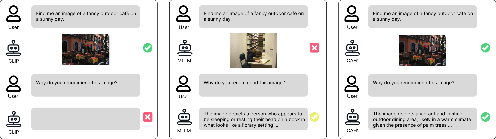

# CAFe: Unifying Representation and Generation with Contrastive-Autoregressive Finetuning

Source code for [CAFe: Unifying Representation and Generation with Contrastive-Autoregressive Finetuning](https://arxiv.org/pdf/2503.19900)



## Installation

Install the package following [LLaVA-NeXT](https://github.com/LLaVA-VL/LLaVA-NeXT):
```bash
conda create -n llava python=3.10 -y
conda activate llava
pip install --upgrade pip
pip install -e ".[train]"
```

## Dataset

During training, we only use subsets of LLaVA one vision training data specified in ```data/dataset.yaml```. 

LLaVA one vision training data can be downloaded from [here](https://huggingface.co/datasets/lmms-lab/LLaVA-OneVision-Data).

After downloading these datasets, convert each dataset into the format of [LLaVA-OneVision](https://huggingface.co/datasets/lmms-lab/LLaVA-OneVision-Data#code-guidance), i.e., a json file and an image folder. Place them under ```data``` and conduct the training with the converted datasets.

Example converting script: ```scripts/prepare_data.py```

## Train

To train CAFe, we provide a sample training script ```scripts/train.sh```.

The training datasets are specified through --data_path and image_folder following the format of [LLaVA-NeXT](https://github.com/LLaVA-VL/LLaVA-NeXT). ```--compute_language_loss``` and ```--compute_contrastive_loss``` control whether to compute language modeling and contrastive loss. ```--con_weight``` decides the weight of the contrastive loss.

## Evaluation

### Zero-shot image-text retrieval on MSCOCO and Flickr
```
python eval/eval_retrieval.py \
    --ckpt=/CKPT/PATH/ \
```

### Multimodal retrieval on [MMEB](https://huggingface.co/datasets/TIGER-Lab/MMEB-eval) 

Clone [VLM2Vec](https://github.com/TIGER-AI-Lab/VLM2Vec) and follow the instructions there to download the MMEB dataset. 

To train CAFe on MMEB, prepare the dataset following the same format as described earlier and enable ```--multimodal_input``` when training.

To evaluate, run the following script (modified from [VLM2Vec](https://github.com/TIGER-AI-Lab/VLM2Vec)) and replace the subset_name with the desired dataset names:

```
python eval/eval_mmeb.py \
  --encode_output_path output/vlm_outputs/ \
  --dataset_name TIGER-Lab/MMEB-eval \
  --subset_name ImageNet-1K N24News HatefulMemes \
  --dataset_split test --per_device_eval_batch_size 4 \
  --image_dir data/eval_images/
```
### Multimodal understanding
 Please follow the instructions in [lmm-eval](https://github.com/EvolvingLMMs-Lab/lmms-eval) for the setup and evaluations. CAFe can be evaluated as the MLLM LLaVa-OV. For example, to evaluate on MMStar:
```
accelerate launch --num_processes 8 --main_process_port 12345 -m lmms_eval \
    --model=llava_onevision \
    --model_args=pretrained=${CKPT_PATH},conv_template=qwen_1_5,model_name=llava_qwen \
    --tasks="mmstar" \
    --batch_size=1 \
    --log_samples \
    --log_samples_suffix=$TASK_SUFFIX \
    --output_path="./logs/" \
    --wandb_args=project=lmms-eval
```
### Hallucination 
Please refer to [POPE](https://github.com/RUCAIBox/POPE) and [THRONE](https://arxiv.org/pdf/2405.05256).

## Citation

If you find it useful for your research and applications, please cite related papers using this BibTeX:

```bibtex
@article{yu2025cafe,
  title={CAFe: Unifying Representation and Generation with Contrastive-Autoregressive Finetuning},
  author={Yu, Hao and Zhao, Zhuokai and Yan, Shen and Korycki, Lukasz and Wang, Jianyu and He, Baosheng and Liu, Jiayi and Zhang, Lizhu and Fan, Xiangjun and Yu, Hanchao},
  journal={arXiv preprint arXiv:2503.19900},
  year={2025}
}
```

## Acknowledgement

- The repository is heavily build upon [LLaVA-NeXT](https://github.com/LLaVA-VL/LLaVA-NeXT).
